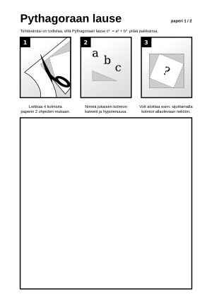
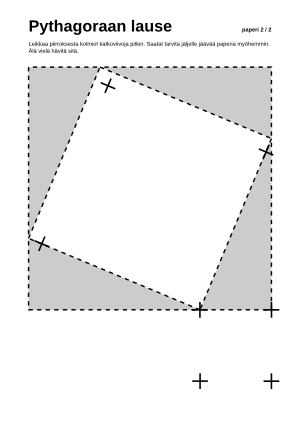
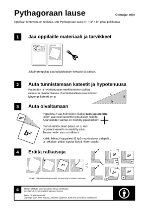

Scroll down for brief English description

- - -

# Pythagoraan lause

*Matematiikan toiminnallinen tehtävä*

## Sisältö

Pythagoraan lause on toiminnallinen tehtävä, jonka tekemiseen oppilas tarvitsee tässä projektissa jaossa olevan kolmisivuisen PDF:n kaksi ensimmäistä sivua, sakset ja kynän.

Toimintaohjeet oppilaalle on PDF:n ensimmäisellä sivulla. Opettajalle on ohjeita kolmannella sivulla.

 
 
 

## Muokkaus

Muokkaa SVG-tiedostoa [Inkscapella](http://www.inkscape.org). Jokaisella sivulla on oma tasonsa (Layer). Kaikki sivut on piilotettu, joten käytä Layers-työkalua saadaksesi sivun näkyviin.

## Yhdistäminen yhdeksi PDF:ksi

Inkscapesta voi tallentaa vain yksisivuisia PDF-tiedostoja. Tallenna sivut yksitellen omiksi tiedostoikseen, esim. p1.pdf, p2.pdf ja p3.pdf. Yhdistämiseen tarvitset jonkin PDF-työkalun.

Linuxissa toimii:

```
pdftk p?.pdf cat output output.pdf
```

pdftk:n saat Debian-pohjaisissa Linuxeissa asennettua komennolla
```
sudo apt-get install pdftk
```

### Nopein tapa tuottaa Inkscape SVG:stä yksi PDF

Toimii Linuxissa, johon on asennettu xmlstarlet, pdftk ja inkscape:

1. Lataa skripti, jolla saa tasot (layer) yksitellen PDF:iksi
- tekijä: https://gist.github.com/petrelharp/bbb0bacf999a412870af
2. aja skripti kaikille tasoille (page1, page2, page3)

```
wget -nc https://gist.githubusercontent.com/petrelharp/bbb0bacf999a412870af/raw/77b0a9f4c2a71733d1d750a61d5d15f4be596cb3/export-inkscape-layers-svg.sh

for i in 1 2 3
do
  bash export-inkscape-layers-svg.sh Pythagorean_theorem_handout.svg page$i > p$i.pdf
done

pdftk p?.pdf cat output Pythagorean_theorem_handout.pdf
```

## Lisenssi

CC-BY

- - -

# Prove the Pythagorean Theorem handout

This is a handout for learning to prove the Pythagorean Theorem. You can modify the SVG with Inkscape.

The first two pages are for the student. Scissors are needed to cut out the triangles on page two. 

The three pages are placed in Inkscape layers. Use Layers tool to make manage layer visibility. (Shift-Ctrl-L)

## License

CC-BY
